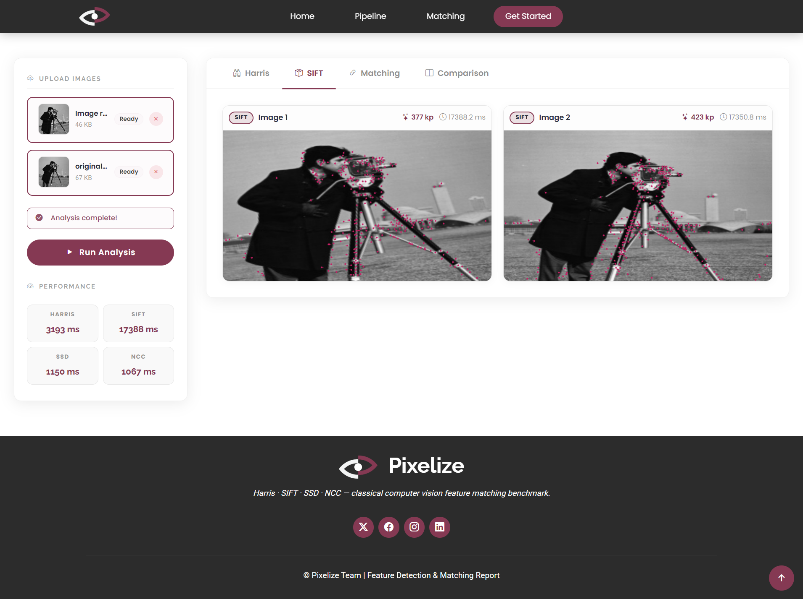
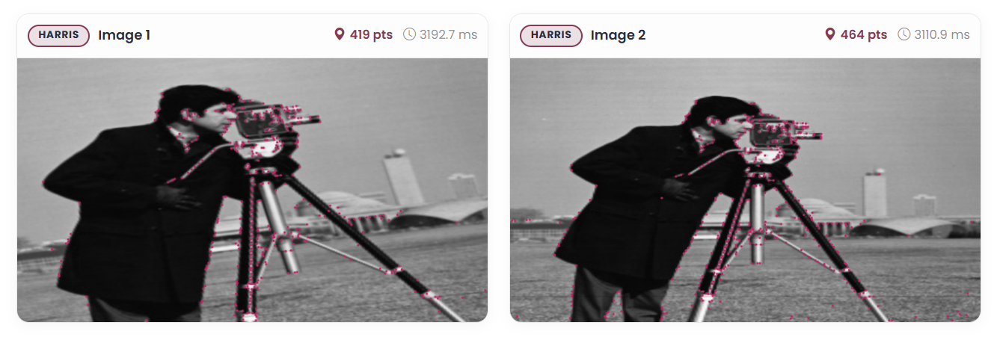
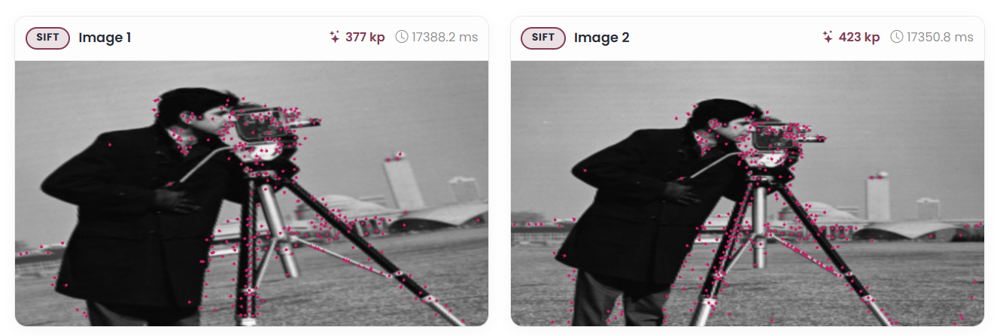
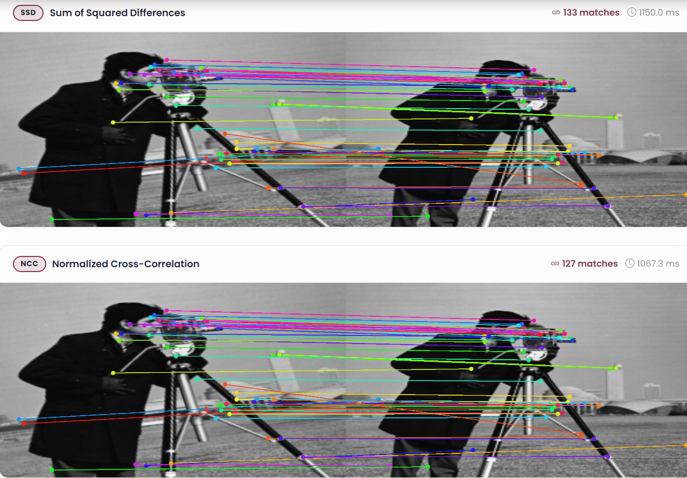

# Computer Vision Pipeline: Feature Detection and Matching

## Overview
This project implements a full classical computer vision pipeline from scratch:

1. Interest point detection (Harris and Shi-Tomasi/Lambda)
2. SIFT-like local feature description
3. Feature matching (SSD and NCC)

The system is split into a C++ backend (REST API) and a browser-based frontend for interactive visualization.

## Architecture
- Backend (C++): Implements image processing and exposes API endpoints using `httplib`.
- Frontend (HTML/CSS/JS): Lets you upload images, choose operations, and view visual results.

### UI Preview


## Algorithms

### 1. Interest Point Detection (Harris and Shi-Tomasi/Lambda)
Both detectors rely on local intensity variation and structure tensor analysis.

- Preprocessing: Compute image gradients using $3 \times 3$ Sobel kernels.
- Tensor terms: Build and smooth $I_x^2$, $I_y^2$, and $I_x I_y$.
- Response:
   - Harris: $R = \det(M) - k \cdot \operatorname{trace}(M)^2$
   - Shi-Tomasi: $R = \min(\lambda_1, \lambda_2)$
- Keypoint selection: Threshold + non-maximum suppression ($7 \times 7$ window), capped at 3000 points.



### 2. Local Feature Description (SIFT-like)
For each keypoint, a robust descriptor is generated.

- Neighborhood: $16 \times 16$ patch around each keypoint.
- Spatial bins: Divide into $4 \times 4$ cells.
- Orientation bins: 8 bins per cell.
- Descriptor length: $4 \times 4 \times 8 = 128$.
- Normalization: L2 normalize, clamp at 0.2, then renormalize.



### 3. Feature Matching (SSD and NCC)
Descriptors between two images are matched using:

- Nearest-neighbor matching
- Lowe ratio test (default thresholds: SSD 0.75, NCC 0.80)
- Bidirectional cross-check for stronger consistency

Visualization draws colored connection lines between corresponding points.



## Project Structure

```
Backend/                    # C++ backend and API
   include/                  # Third-party headers
   operations/               # Harris, Lambda, SIFT, Matcher implementations
   main.cpp                  # Server entry point
   CMakeLists.txt            # Build configuration
Frontend/                   # Web interface
Test_Cases/                 # Test images
readme_images/              # README screenshots/results
```

## Setup and Run

1. Build and run backend (Windows):

```cmd
cd Backend
run.bat
```

Backend should start on `http://localhost:8080`.

2. Serve frontend:

```cmd
cd Frontend
python -m http.server 3000
```

Open `http://localhost:3000` in your browser.
